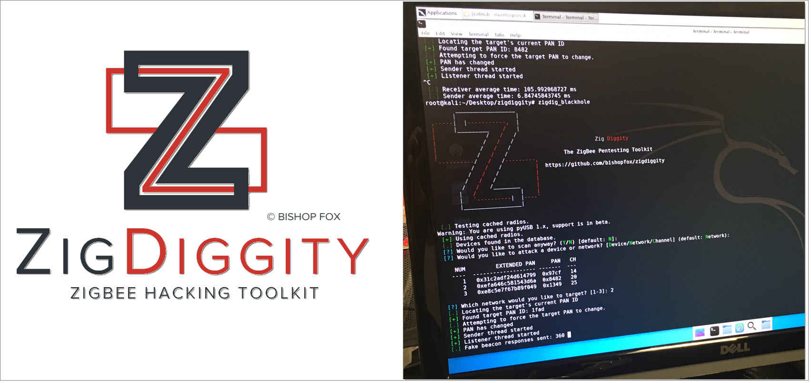
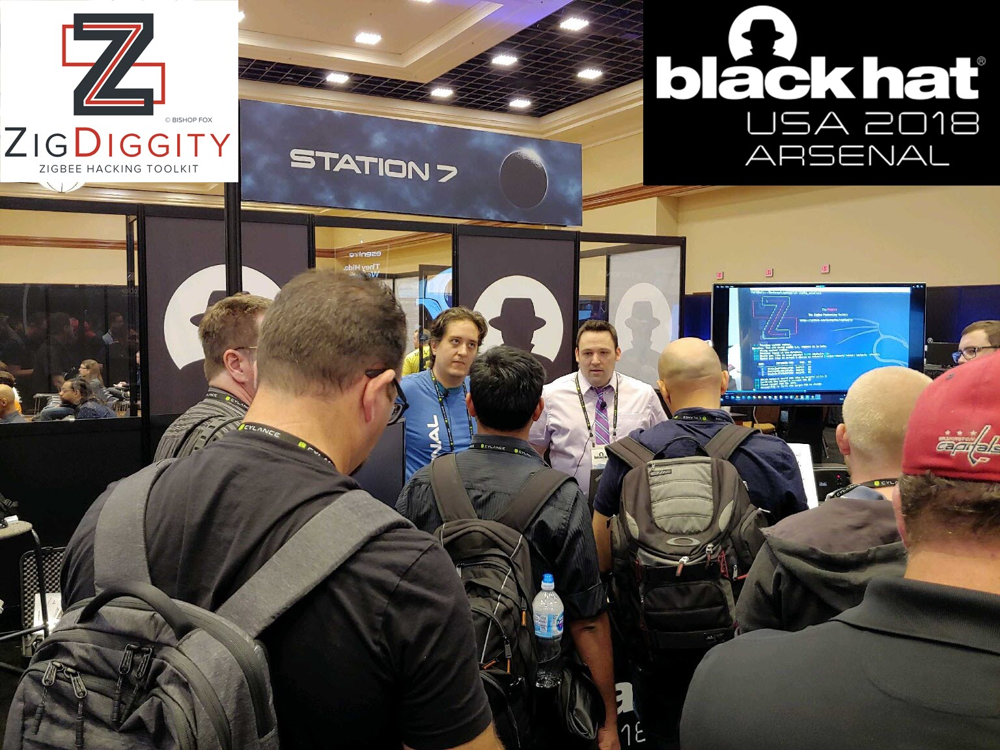
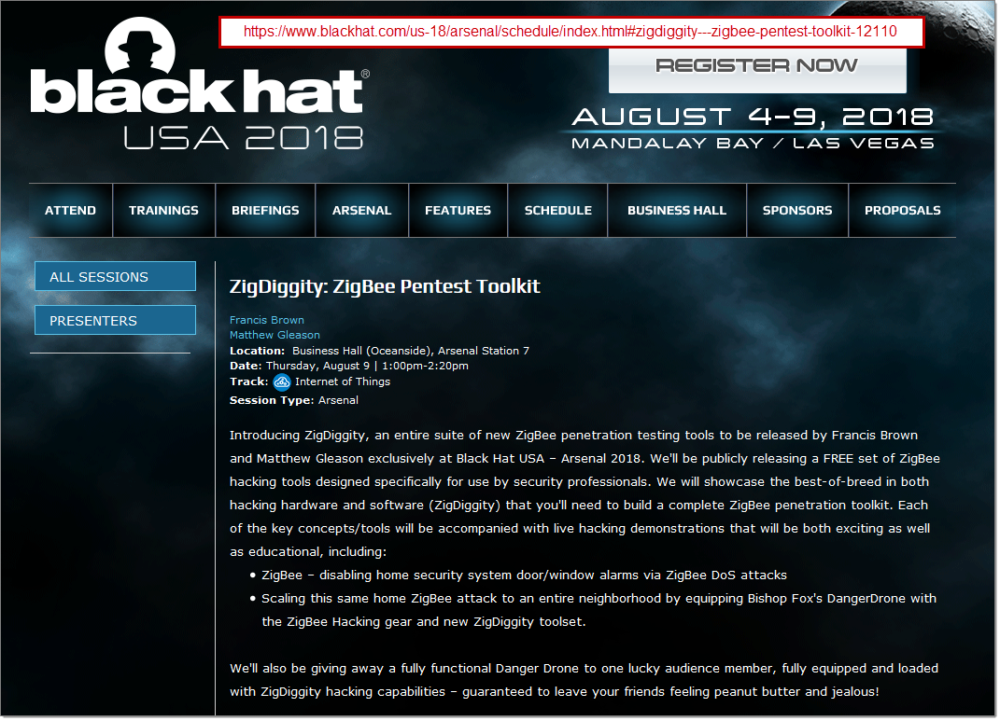

# ZigDiggity

Introducing ZigDiggity, an entire suite of new ZigBee penetration testing tools, created by Francis Brown and Matthew Gleason of [BishopFox-Home](https://www.bishopfox.com/ "Bishop Fox").

*ZigDiggity* is a Zigbee hacking toolkit designed to introduce previously unpublished attack patterns and make testing a bit easier. The project introduces two new attack patterns:

* The *Ack Attack* - An acknowledgement-based attack meant to attempt Zigbee endpoint devices to malfunction.
* The *Rejoin Blackhole Attack* - A method of replying to request beacons to force endpoint devices to try to connect to a user-specified PAN ID.

## Installation

Installation is as simple as using the setup.py file to install the tool:

```
python setup.py install
```

After installation is complete the tools will be available to you to use.

### Hardware

The current version of ZigDiggity is solely designed for use of KillerBee cards. The card will need to have the KillerBee firmware installed prior to use.

## Usage

ZigDiggity attempts to avoid the excessive use of command-line arguments, especially those that are just big chunks of hexadecimal data. An example usage for the ``zigdig_ackattack`` tools is as follows:

```
zigdig_ackattack
```

The script will prompt for any data needed as it runs.

## Tools

The tools introduced in ZigDiggity come in two forms, one for performing the various attacks, the other for managing the data stored by ZigDiggity between script runs.

### Attack-pattern Tools

* *zigdig_ackattack* - The raw form of the Ack Attack. The tool will attempt to reply to every 802.15.4 packet that should be acknowledged. Additionally, if there is a network key in the ZigDiggity cache, it will attempt to reply to the Zigbee APS packets as well.
* *zigdig_ackattack_minimal* - A minimized version of the Ack Attack. The tool will only attempt to reply to ``Data Request`` packets to attempt to disrupt the affected device.
* *zigdig_blackhole* - The rejoin blackhole attack. The tool will monitor for ``Beacon Request``s to send out responses that have the same extended PAN ID as the targeted network. When the race is won, the device will attempt to connect to the PAN ID specified by the tool, fail, and attempt the rejoin process again.
* *zigdig_blackhole_aggressive* - A form of the rejoin blackhole attack sending pre-emptive beacon responses. The tool will generate a lot of traffic, but does not appear to disrupt Zigbee networks hosted on the same channel.
* *zigdig_insecurerejoin* - Sends an insecure rejoin request to the targeted network attempting to disclose the network's encryption keys.
* *zigdig_pandemonium* - A modified version of the KillerBee ``zbpanidconflictflood`` attack pattern. This version can attempt to be targeted against a specific network and has modifications attempting to improve overall reliability.

### Data Management Tools

* *zigdig_cleardevices* - Clears the ZigDiggity device list
* *zigdig_clearnetworks* - Clears the ZigDiggity network list, including any encryption keys captured during the script runs
* *zigdig_clearall* - Clears both the devices and networks.

## Notes

The patterns used by the ZigDiggity toolkit are _not_ 100% reliable. Each is designed to be used in a test setting in order to determine how devices respond to less than optimal conditions. As the radio technology get faster, many of these attack patterns should become more reliable.

New tools are planned to be added as the reliability of the tools can be improved.

## Black Hat USA 2018 - Tool Arsenal - ZigDiggity - 09 August 2018

Special thanks to the Black Hat USA 2018 Tool Arsenal folks for having us out to demonstrate ZigDiggity on 09Aug2018.

See link and photos:
* [ZigDiggity: ZigBee Pentest Toolkit - Black Hat USA 2018 | Arsenal Schedule](https://www.blackhat.com/us-18/arsenal/schedule/index.html#zigdiggity-zigbee-pentest-toolkit-12110 "ZigDiggity: ZigBee Pentest Toolkit - Black Hat USA 2018 | Arsenal Schedule")
	* 
	* 