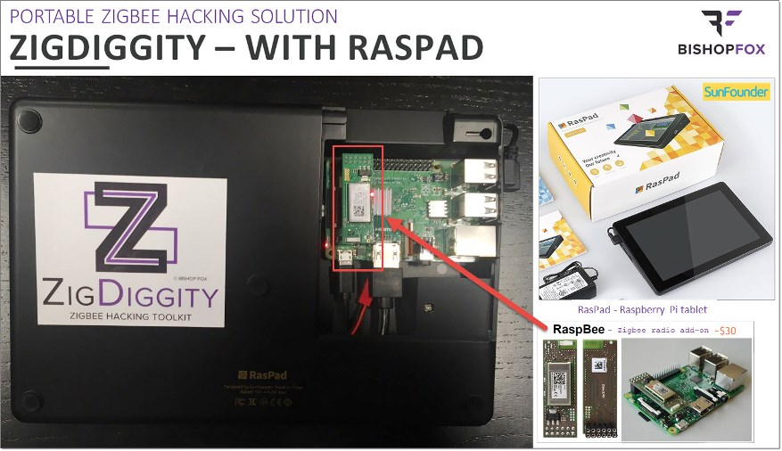

# ZigDiggity Version 2

Introducing *ZigDiggity 2.0*, a ZigBee penetration testing framework created by Matt Gleason & Francis Brown of [Bishop Fox](https://www.bishopfox.com/ "Bishop Fox").   Special thanks to Caleb Marion!

*ZigDiggity* version 2 is a major overhaul of the original package and aims to enable cybersecurity professionals, auditors, and developers to run complex interactions with ZigBee networks using a single device. 

## 2019 - Black Hat USA 2019 & DEF CON 27 - links, slides, and videos
* [Black Hat USA 2019 - ARSENAL LAB - ZigBee Hacking: Smarter Home Invasion with ZigDiggity - Aug 7-8, 2019](https://www.blackhat.com/us-19/arsenal/schedule/index.html#arsenal-lab---zigbee-hacking-smarter-home-invasion-with-zigdiggity-17151 "Black Hat USA 2019 - ARSENAL LAB - ZigBee Hacking: Smarter Home Invasion with ZigDiggity - Aug 7-8, 2019")
* https://www.defcon.org/html/defcon-27/dc-27-demolabs.html#ZigDiggity
  * 

### Videos
* [YouTube - Zigbee Hacking: Smarter Home Invasion with ZigDiggity - 58sec DEMO - 20Aug2019](https://www.youtube.com/watch?v=9_0SoKsVklMQ "YouTube - Zigbee Hacking: Smarter Home Invasion with ZigDiggity - 58sec DEMO - 20Aug2019")
  * Defeating Zigbee smart locks & home alarm sensors; demonstrating effective IoT product security evaluations using ZigDiggity 2.0 - the new open-source Zigbee pentest toolkit from Bishop Fox.

<a href="http://www.youtube.com/watch?feature=player_embedded&v=9_0SoKsVklM
" target="_blank"></a>

### Slides
* https://www.slideshare.net/bishopfox/smarter-home-invasion-with-zigdiggity-165606623
* https://www.bishopfox.com/files/slides/2019/Black_Hat_USA_2019-Zigbee_Hacking-Smarter_Home_Invasion_with_ZigDiggity-08Aug2019-Slides.pdf

### ABSTRACT:
> Do you feel safe in your home with the security system armed? You may reconsider after watching a demo of our new hacking toolkit, ZigDiggity, where we target door & window sensors using an "ACK Attack". ZigDiggity will emerge as the weapon of choice for testing Zigbee-enabled systems, replacing all previous efforts.
>     
> Zigbee continues to grow in popularity as a method for providing simple wireless communication between devices (i.e. low power/traffic, short distance), & can be found in a variety of consumer products that range from smart home automation to healthcare. Security concerns introduced by these systems are just as diverse and plentiful, underscoring a need for quality assessment tools.  
>     
> Unfortunately, existing Zigbee hacking solutions have fallen into disrepair, having barely been maintained, let alone improved upon. Left without a practical way to evaluate the security of Zigbee networks, we've created ZigDiggity, a new open-source pentest arsenal from Bishop Fox.
>     
> Our DEMO-rich presentation showcases ZigDiggity's attack capabilities by pitting it against common Internet of Things (IoT) products that use Zigbee. Come experience the future of Zigbee hacking, in a talk that the New York Times will be hailing as "a veritable triumph of the human spirit." ... ya know, probably


## Installation

Using a default install of Raspbian (GUI install, not headless), perform the following steps:

* With your Raspberry Pi powered off, plug your Raspbee into your Raspberry Pi
* Clone this repository onto your Raspberry Pi and cd into the ZigDiggity directory
* Enable serial using the `sudo raspbi-config` command
  * Select "Advanced Options/Serial"
  * Select *NO* to "Would you like a login shell to be accessible over serial?"
  * Select *YES* to enabling serial
  * Restart the Raspberry Pi
* Install GCFFlasher available [Here](http://deconz.dresden-elektronik.de/raspbian/gcfflasher/gcfflasher-latest.deb)
  * `wget http://deconz.dresden-elektronik.de/raspbian/gcfflasher/gcfflasher-latest.deb`
  * `sudo dpkg -i gcfflasher-latest.deb`
  * `sudo apt update`
  * `sudo apt -f install`
* Flash the Raspbee's firmware
  * `sudo GCFFlasher -f firmware/zigdiggity_raspbee.bin`
  * `sudo GCFFlasher -r`
* Install the python requirements using `pip3 install -r requirements.txt`
* Patch scapy `sudo cp patch/zigbee.py /home/$USER/.local/lib/python3.7/site-packages/scapy/layers/zigbee.py`
* Install wireshark on the device using `sudo apt install wireshark`
  * be sure to add your user to the wireshark group (e.g. `sudo usermod -a -G wireshark $USER`). Log out and back in again for the changes to take effect.

### Hardware

The current version of ZigDiggity is solely designed for use with the [Raspbee](https://www.dresden-elektronik.de/funktechnik/solutions/wireless-light-control/raspbee/?L=1)
* https://www.amazon.com/RaspBee-premium-ZigBee-Raspberry-Firmware/dp/B00E6300DO
	* 
* Raspberry Pi 3 B+
	* https://www.amazon.com/CanaKit-Raspberry-Power-Supply-Listed/dp/B07BC6WH7V
* RasPad by SunFounder (Optional) - great portable Zigbee hacking solution, tablet to house the RaspPi3 & RaspBee radio:
	* https://www.amazon.com/SunFounder-RasPad-Built-Touchscreen-Compatible/dp/B07JG53K2W/
		* 

## Usage

Currently scripts are available in the root of the repository, they can all be run using Python3:

```python3 listen.py -c 15```

When running with wireshark, root privileges may be required.

### Scripts

* `ack_attack.py` - Performs the acknowledge attack against a given network.
* `beacon.py` - Sends a single beacon and listens for a short time. Intended for finding which networks are near you.
* `find_locks.py` - Examines the network traffic on a channel to determine if device behavior looks like a lock. Displays which devices it thinks are locks.
* `insecure_rejoin.py` - Runs an insecure rejoin attempt on the target network.
* `listen.py` - Listens on a channel piping all output to wireshark for viewing.
* `scan.py` - Moves between channels listening and piping the data to wireshark for viewing.
* `unlock.py` - Attempts to unlock a target lock

## Notes

The patterns used by ZigDiggity version 2 are designed to be as reliable as possible. The tool is still in fairly early stages of development, so expect to see improvements over time.
